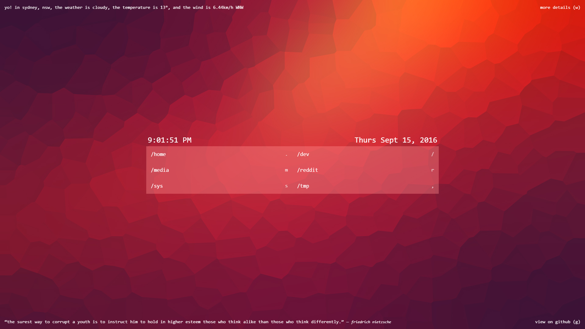

# startpage [https://jibreil.github.io/startpage/](https://jibreil.github.io/startpage/)

##My take on [pschfr's](https://github.com/pschfr/start) new tab page, includes bookmarks, weather, random quotes and a nice background.

##Contents

+ Background is [What Space Really Looks Like](https://www.behance.net/gallery/12984019/What-Space-Really-Looks-Like)
+ Weather is from [monkeecreate/jquery.simpleWeather](https://github.com/monkeecreate/jquery.simpleWeather)
+ Keyboard navigation is from [ccampbell/mousetrap](https://github.com/ccampbell/mousetrap)!

##Installation

1. Download/fork the repo
2. Edit whatever you want
  * Bookmark url's, names and keys can be edited in `index.html`
  * Keys to open weather details and open on github are on lines *84-90* in `script.js`
3. Enable developer mode in the `chrome://extensions/` page
4. Click *Load unpacked extension...* and choose the directory where all the files aare

###Forked from [@pschfr](http://twitter.com/pschfr)/[pschfr](https://github.com/pschfr/start)
